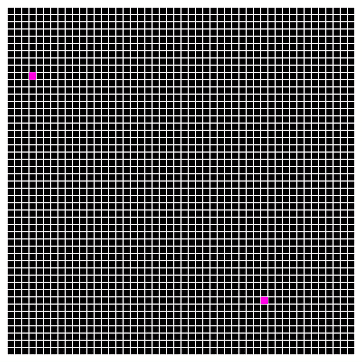
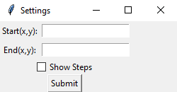

# AStarPathFinding

a python game that serves to visualize the A* search algorithm

## Usage

1. Navigate to the directory/folder containing the script with your terminal/console
2. Run the game with the following command: `py.exe AStarPathFinding.py`
3. The game will begin with a settings window
    - enter the coordinates of the start and end points (x, y)
      - (0, 0) is at the top left corner and (49, 49) is at the bottom right corner
      - points on the grey border are part of the grid and invalid points
    - if you want to see the progress of the algorithm while searching, check the `Show Steps` box
    - click `Submit`

4. The start and end points should be displayed on the board
5. You can now left click and drag the mouse on the board to create obstructions for the algorithm
    - To remove created obstructions, use right click in the same manner
6. Press space bar to begin the search
